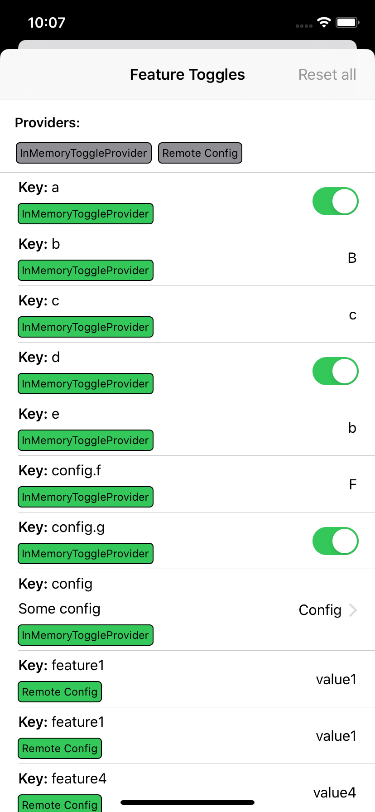

# ToggleUI

ToggleUI is a library that provides property wrappers to create feature toggles for your app with built-in debug view based on SwiftUI and Combine.

## Usage

The simplest way to define a feature toggle is to use `FeatureToggle` property wrapper:

```swift
let userDefaultsProvider = UserDefaultsToggleProvider(userDefaults: .standard)

struct MyFeatureToggles: WithDefaults {
    @FeatureToggle(
        key: "isFeatureEnabled",
        debugDescription: "Enables a feature",
        provider: userDefaultsProvider
    )
    var isFeatureEnabled: Bool
}
```

This creates a Boolean feature toggle with a key `isFeatureEnabled`. It requires a `provide` as its parameter (usually accessible globally rather than created in place). There are built-in providers, like `InMemoryToggleProvider` or `UserDefaultsToggleProvider` and others, but you can as well create your own.

## Supported features

- [Feature Toggles](#featuretoggle)
- [Feature Groups](#FeatureGroup)
- [Codable](#codable-support)
- [DebugView](#debugview)
- [User Interface support](#user-interface-support)

## FeatureToggle

`FeatureToggle<T>` defines a simple feature toggle of Boolean, String, String based Enum or any other Hashable type. Any feature toggle requires at least a key, a default value and a provider. A key can be a string that represents a key path in a KVC style, i.e. `key1.key2.key3` (indexed access to array elements is also supported).

Default value is inferred from the type of the feature toggle, i.e. it's `false` for Boolean and empty string for String, and is used in case of an error when computing effective value of the feature toggle. 

Wrapped value of the `FeatureToggle` is the effective value of the toggle and is computed lazily. That is, every time you access it the value will be computed by calling a `provider`. This means that the value can change over the runtime of your application if underlying source of values for feature toggles changes.

Additionally you can provide `debugDescription` and `debugValues` that will be used in DebugView. For enum based values debug values are inferred from `CaseIterable` implementation.

If you want to implement a toggle of some custom type you can do that by providing a `get` closure. For Boolean, String and Enum types this closure is defined by the library in the extensions which you can define for you own types as well.

As a matter of fact `FeatureToggle` is a type alias of `ProviderResolvingFeatureToggle<T: Hashable, P: ToggleProviderResolving>`  type that defines additional generic type parameter used to access a toggle provider. This way this generic type parameter can be used instead of provider constructor parameter that can be a more convenient way to define feature toggles and immediately distinguish feature toggles backed by different providers. 

For example you can define a type alias that uses `UserDefaultsToggleProvider` like this (this is built-in so you don't have to define it for user defaults provider):

```swift
let userDefaultsProvider = UserDefaultsToggleProvider(userDefaults: .standard)

struct UserDefaultsToggleProviderResolver: ToggleProviderResolving {
    static func makeProviderToggleProvider {
        userDefaultsProvider
    }
}

typealias UserDefaultsFeatureToggle<T: Hashable> = ProviderResolvingFeatureToggle<T, UserDefaultsToggleProviderResolver>

struct MyFeatureToggles {
    @UserDefaultsFeatureToggle(key: "isFeatureEnabled")
    var isFeatureEnabled: Bool
}
```

In cases when you want to observe changes of the feature toggle effective value and update the app when these values change you can use `ObservableFeatureToggle` (or `ProviderResolvingObservableFeatureToggle` to specify provider via generic type parameter). The only difference between observable and plain feature toggle is that observable feature toggle wrapped value type is `AnyPublisher<T, Never>`.

## FeatureGroup

Feature group is a collection of related feature toggles. You can use it to enabled/disable the feature and at the same time control some of its additional properties, or to group together feature toggles for smaller features in a large feature of your app. Feature group is defined using `FeatureGroup<T: FeatureGroupDecodable>` type and works pretty much the same as any feature toggle (and in fact is backed by a feature toggle) so can be observed using `ObservableFeatureGroup` and is typealiased to `ProviderResolvingFeatureGroup<T: FeatureGroupDecodable, P: ToggleProviderResolving>`.

Feature group type must implement `FeatureGroupDecodable` protocol that only requires to declare an empty `init()` constructor. Each feature toggle in the group is defined using `FeatureGroupProperty` property wrapper. The key of each property will be combined of its feature group's key and the property's own key. In the following example the key of the `someFeatureProperty` feature toggle will be `config.someFeatureProperty`:

```swift
struct Config: FeatureGroupDecodable {
    @FeatureGroupProperty(key: "someFeatureProperty")
    var someFeatureProperty: String

    init() {}
}

@FeatureGroup(key: "config")
var config: Config
```

Feature group can contain other feature groups. You should only use `FeatureGroupProperty` for the properties of the feature group. They don't provide observable counterparts. For observing these values use `ObservableFeatureGroup` and `map` operator to create an observer for individual property. 

## ToggleProvider

To actually access values of your feature toggles you need a "provider". ToggleUI comes with some built-in providers like `UserDefaultsToggleProvider` and `InMemoryToggleProvider` that use user defaults or in memory storage as the source of values for feature toggles. Each toggle provider must implement `ToggleProvider` protocol. Each toggle provider should define an actual provider and an `override` provider that additionally must implement `ToggleOverriding` protocol that is used to override values at runtime from DebugView. By default `provider` returns `self` and `override` returns an instance of `DefaultToggleProvider` that always returns default value of a feature toggle, returns `false` in `hasValue` method and does nothing in `setValue` method (effectively not providing any override functionality).  With that you can combine different providers together, i.e. you can use user defaults provider as an actual provider and in-memory provider as override provider and combine them using built-in `OverridableToggleProvider`:

```swift
var currentProvider: ToggleProvider = OverridableToggleProvider(
    provider: inMemoryProvider,
    override: userDefaultsProvider
)
```

## ToggleDecoder

Toggle providers use toggle decoders to decode values from underlying storage, which can be in-memory dictionary, user defaults, remote JSON or any other storage. ToggleUI comes with a built-in `DictionaryToggleDecoder` that implements exception-safe KVC access to values stored in string-keyed dictionary. This decoder is used by `InMemoryToggleProvider` and `UserDefaultsToggleProvider`.

If you are using a 3rd party configuration framework, i.e. Optimizely or Firebase, you will need to implement both provider and a decoder that would use these tools SDKs types to get values from these services.

## Codable support

If you are using your own configuration service you can implement a `ToggleProvider` for it using built-in `Codable` support. For that your provider must implement `CodableToggleProvider` protocol that requires a `dataPublisher` property. This protocol by default uses built-in `CodableToggleDecoder` that can lazily decode values from the data. Here is an example of how to implement such provider using URLSession.

1. create a data publisher:

```swift
class ConfigPublisher {
    var bag = Set<AnyCancellable>()
    let publisher: AnyPublisher<Result<Data, Error>, Never>

    init(session: URLSession = URLSession.shared) {
        let subject = CurrentValueSubject<Result<Data, Error>?, Never>(nil)
        session
            .dataTaskPublisher(for: URL(string: "...")!)
            .sink(
                // do not complete publisher to allow receiving future values, i.e. from override provider
                receiveCompletion: { _ in },
                receiveValue: { data, _ in subject.send(.success(data)) }
            ).store(in: &bag)
        self.publisher = subject
            // filter out initial and further nil data values
            .filter { $0 != nil }.map { $0! }
            .eraseToAnyPublisher()
    }
}

// use a global shared instance to ensure that network is accessed only once for all feature toggles
let DataPublisher: AnyPublisher<Result<Data, Error>, Never> = ConfigPublisher()
```

2. create a toggle provider:

```swift
class URLSessionRemoteToggleProvider: CodableToggleProvider {
    var name: String = "Remote Config"
    // decode keys right from the root
    typealias DecoderCaptured = ToggleUI.DecoderCaptured

    let dataPublisher = DataPublisher.publisher
}

let urlConfigProvider = OverridableToggleProvider(
    provider: URLSessionRemoteToggleProvider(),
    override: userDefaultsProvider
)
```

`DecoderCaptured` associated type can be used to simplify access to the values that are namespaced under a certain key, or to define separate providers that access values from different namespaces. Built-in `DecoderCaptured` implementation simply captures root decoder but you can implement your own types that would capture decoder for arbitrary nested key using `DecoderCapturing` protocol. For example if your feature toggle values are namespaced under the `config` key in the JSON returned by your configuration service API then you can implement your provider like this:

```swift
struct ConfigDecoderCaptured: DecoderCapturing {
    enum CodingKeys: String, CodingKey {
        case decoder = "config"
    }
    
    // Built-in `DecoderCaptured` type can be used as a property wrapper 
    // to capture decoder by a key of a wrapped property 
    // Here it will be `config` key as it's the raw value of associated coding key
    @DecoderCaptured var decoder: Decoder
    
    // Alternatively you can define `init(from: Decoder)` and capture decoder 
    // using `superDecoder(forKey:)` method if your JSON structure is less trivial
    /**
    init(from decoder: Decoder) throws {
        let values = try decoder.container(keyedBy: CodingKeys.self)
        self.decoder = try values.superDecoder(forKey: .decoder)
    }
    */
}

class URLSessionRemoteToggleProvider: CodableToggleProvider {
    // Use custom associated type insead of built-in
    typealias DecoderCaptured = ConfigDecoderCaptured

    ...
}
```

This way provider will capture a decoder for `config` key rather than a root decoder. With that you won't need to use `config.` prefix in the keys of each feature toggle.


## DebugView

ToggleUI comes with a built-in `DebugView` implemented in SwiftUI. It allows to inspect and override values of feature toggles at runtime.



For `DebugView` to discover your feature toggles you should define them inside a type that implements `WithDefaults` protocol and instantiate its value before accessing `DebugView`. When this instance is instantiated the framework uses `Mirror` to access all of its properties wrapped with `FeatureToggle` or `FeatureGroup` property wrappers and stores them in `ToggleUI.debugToggles` global variable that `DebugView` then uses. `WithDefaults` protocol also allows to override default values of some feature toggles that can be useful to enforce their values in debug builds.

```swift
struct MyFeatureGroup: FeatureGroupDecodable {
    @FeatureGroupProperty(key: "featureA")
    var featureA: Bool

    init() {}
}

struct Toggles: WithDefaults {
    @UserDefaultsFeatureToggle(key: "featureA")
    var featureA: Bool
    
    @UserDefaultsFeatureToggle(key: "featureB")
    var featureB: Bool
    
    @UserDefaultsFeatureGroup(key: "featureGroup")
    var featureGroup: MyFeatureGroup
}

let toggles = Toggles().withDefaults { toggles in
    #if DEBUG
    // change the default value
    toggles.$featureA.defaultValue = true
    toggles.$featureGroup.defaultValue.$featureA = true
    
    // or override the value
    toggles.$featureB.setValue(true)
    toggles.$featureGroup.$featureA.setValue(true)
    #endif
}
```

## User interface support

If you want to provide your users with controls to configure or just view features of your app you can do that using `AnyMutableFeatureToggle`/`AnyMutableFeatureGroup` that allows to override feature toggles values via SwiftUI bindings or `AnyFeatureToggle`/`AnyFeatureGroup` that will only display current values and won't allow changing them.

For example if you have a simple boolean feature toggle you can display a `Toggle` that will allow user to change its value at runtime:

```swift
let userDefaultsProvider = OverridableToggleProvider(
    provider: DefaultToggleProvider(),
    override: UserDefaultsToggleProvider(userDefaults: .standard)
)

struct MyFeatureToggles: WithDefaults {
    @FeatureToggle(
        key: "isFeatureEnabled",
        debugDescription: "Enables a feature",
        provider: userDefaultsProvider
    )
    var isFeatureEnabled: Bool
}

let toggles = MyFeatureToggles()

struct SettingsView: View {
    @ObservedObject var featureA = AnyMutableFeatureToggle(toggles.$featureA)
    
    var body: some View {
        Form {
            Toggle("Feature A", isOn: featureA.binding)
        }
    }
}
```

For feature groups you can access bindings for feature group properties like this:

```swift
struct MyFeatureGroup: FeatureGroupDecodable {
    @FeatureGroupProperty(key: "featureA")
    var featureA: Bool
    @FeatureGroupProperty(key: "featureB")
    var featureB: Bool

    init() {}
}

struct MyFeatureToggles: WithDefaults {
    @FeatureGroup(
        key: "featureGroup",
        provider: userDefaultsProvider
    )
    var featureGroup: MyFeatureGroup
}

let toggles = MyFeatureToggles()

struct SettingsView: View {
    @ObservedObject var featureGroup = AnyMutableFeatureGroup(toggles.$featureGroup)
    
    var body: some View {
        Form {
            Toggle("Feature A", isOn: featureGroup.$featureA)
            Toggle("Feature B", isOn: featureGroup.$featureB)
        }
    }
}
```

As we are using `@ObservedObject` here the state of UI toggles will also get updated if the value of the feature toggles was changed via `DebugView`.

## License

ToggleUI is available under the MIT license. See [LICENSE](LICENSE) for more information.
